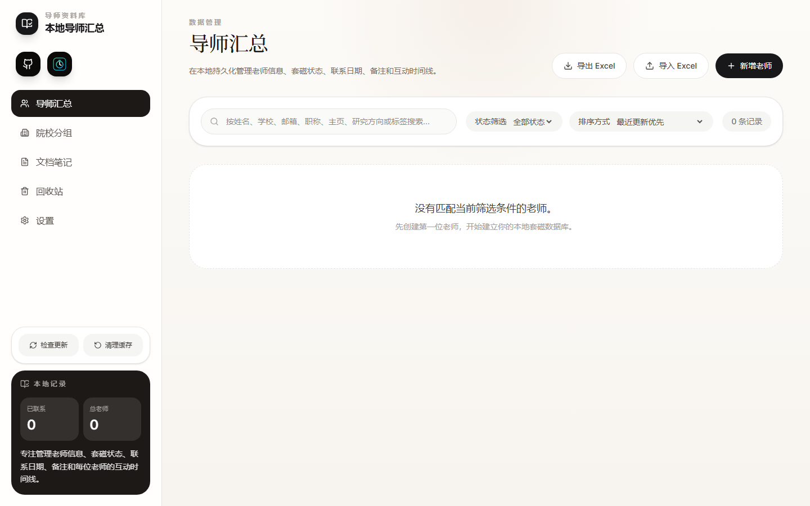

# Mentor Vault

Mentor Vault 是一个本地桌面端导师汇总工具，用来像表格一样记录导师、学校、研究方向、联系状态和套磁进展。



## 主要功能

- 老师信息管理：姓名、学校、职称、邮箱、主页、研究方向、状态、标签和备注。
- 按状态整理：在导师汇总中按状态查看和筛选记录。
- 院校分组：单独的院校分组视图，可以查看每个学校已联系的老师和对应进展。
- 文档笔记：单独的本地笔记界面，可记录申请想法、面试准备、院校信息和其他临时文档，支持插入图片并导出为 Markdown。
- 自定义排序：笔记索引、院校索引和学院索引支持手动拖拽调整顺序。
- 进展时间线：为每位老师记录初次联系、跟进、回复、备注等事件。
- 本地数据存储：用户数据保存在电脑本地，安装包和 GitHub Release 不包含用户个人数据。
- 导入导出：支持从表格导入老师记录，也支持导出记录。
- 半自动更新：程序可以读取公开的 `latest.json`，发现新版本后让用户选择增量下载或全量下载。
- 快捷入口：导师汇总页顶部提供项目 GitHub 和 CS 保研 DDL 的外链小图标。

## 下载和安装

请到右侧 Releases 页面下载最新版安装程序：

```text
https://github.com/Luofaiz/mentor-vault/releases/latest
```

下载 `MentorVaultSetup.exe` 后运行安装即可。

## 数据位置

用户数据保存在 Windows 的 `%APPDATA%\Mentor Vault` 文件夹中，通常对应：

```text
C:\Users\你的用户名\AppData\Roaming\Mentor Vault
```

主要数据文件是 `vibe-data.json`。卸载或安装新版本不会主动删除用户数据。

## 致谢

感谢原项目 [duck-lite/vibe_sender](https://github.com/duck-lite/vibe_sender) 提供的基础思路和项目参考。
